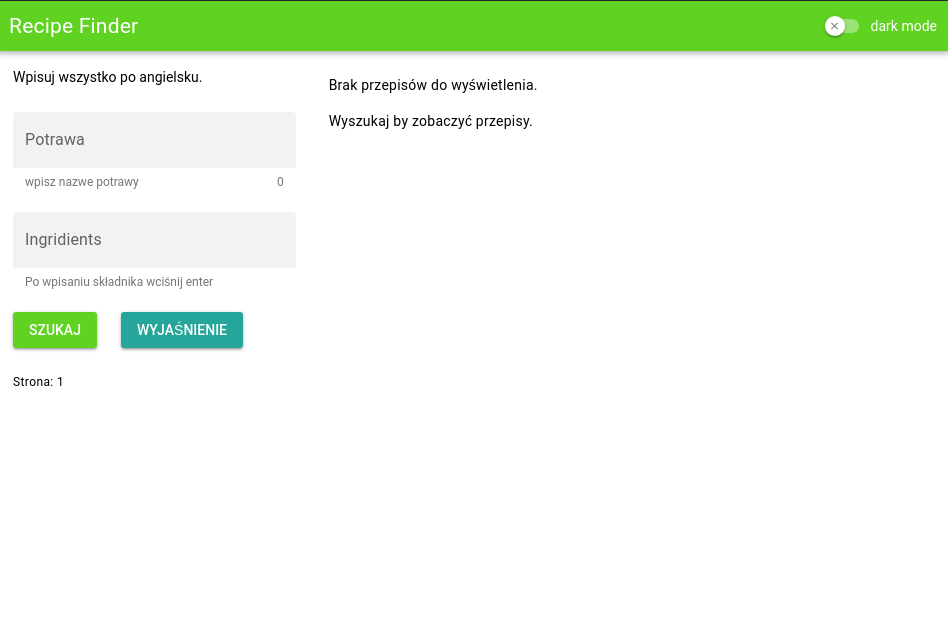
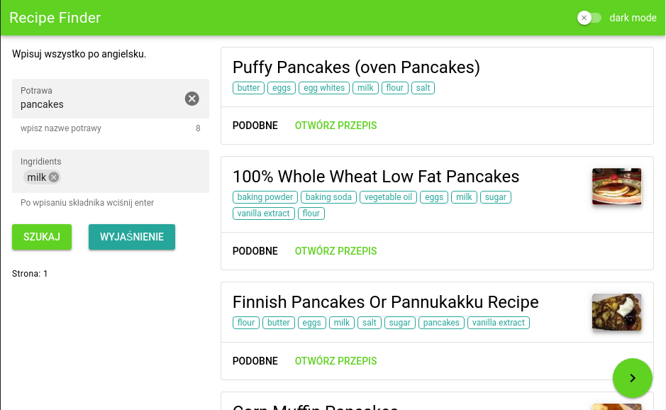
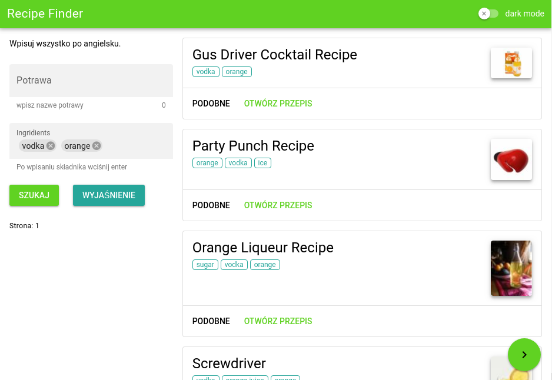
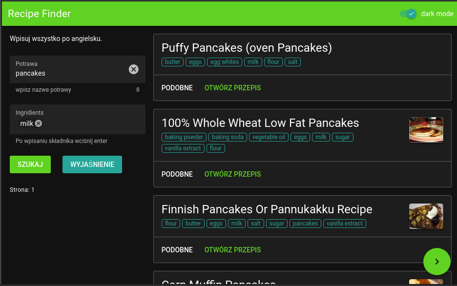
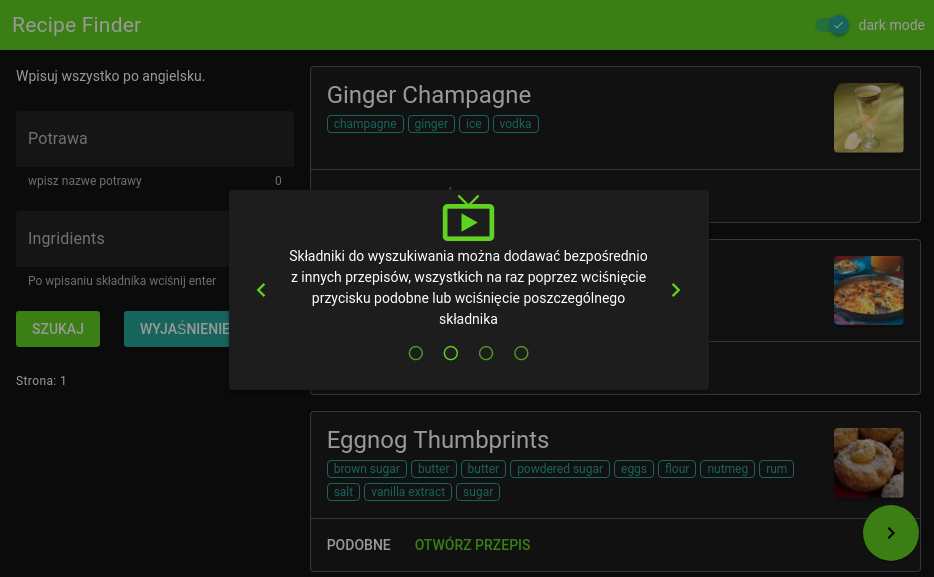

# Diet Creator (dietcreator)

Aplikacja stworzona na zalicznie.

## Użyte biblioteki

- Quasar - obsługa frontendu
- axios - requesty do API [Recipy Puppy](https://recipe-puppy.p.rapidapi.com)

## Zrzuty ekranu

### Puste wyszukiwanie

---

### Wyszukiwanie po składniku mleko

---

### Wyszukiwanie po składniku vodka

---

### Tryb ciemny

---

### Pomoc (modal)

